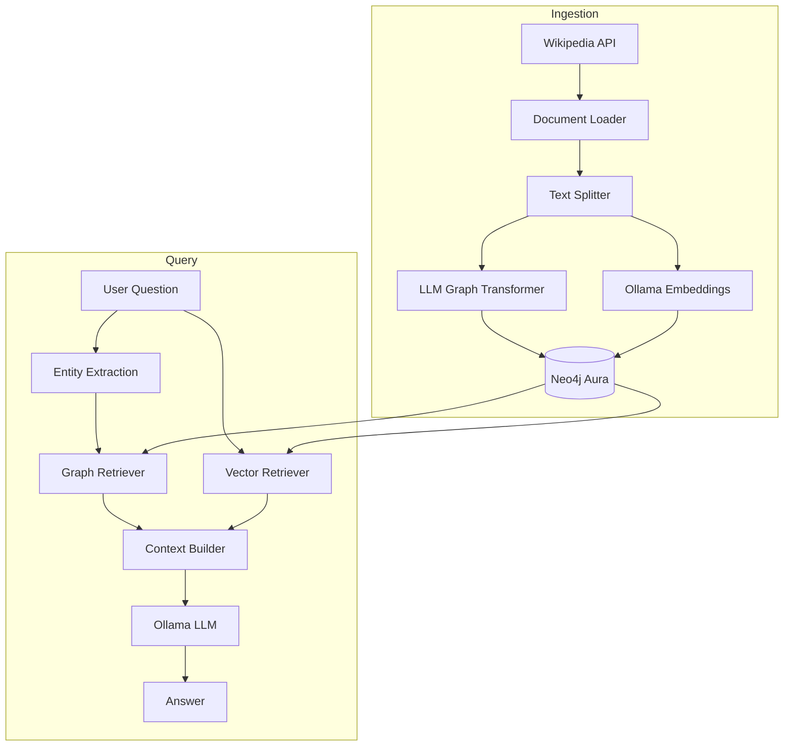

# GraphRAG

A **Graph Retrieval-Augmented Generation (Graph RAG)** pipeline that combines knowledge graphs, vector search, and local large language models to answer questions grounded in structured and unstructured data.

Built with **LangChain**, **Neo4j Aura**, and **Ollama** — a fully local, cost-effective alternative to cloud LLM APIs.

---

## Overview

GraphRAG enriches traditional RAG by storing extracted entities and relationships in a graph database alongside vector embeddings. At query time, the system retrieves context from both the knowledge graph and document chunks, then generates answers using a local Ollama model.

**Default knowledge source:** Wikipedia articles (configurable topic)

**Primary entry point:** [`backend/GraphRagPractice.ipynb`](backend/GraphRagPractice.ipynb)

---

## Features

- **Knowledge graph extraction** — Automatically identifies entities and relationships from text using Ollama
- **Hybrid retrieval** — Combines Neo4j graph traversal with vector similarity search
- **Local LLM inference** — No OpenAI API key required; runs entirely via Ollama
- **Cloud graph storage** — Persists knowledge in Neo4j Aura (free tier supported)
- **Conversational Q&A** — Supports follow-up questions with chat history
- **Optional graph visualization** — Interactive graph widget via yFiles (Jupyter)

---

## Architecture



---

## explore the Generated Graph querry= Imran Khan

<br>
zoom in 
<br>


## Tech Stack

| Component | Technology |
|-----------|------------|
| Orchestration | LangChain |
| LLM | Ollama (`llama3.2`) |
| Embeddings | Ollama (`nomic-embed-text`) |
| Graph database | Neo4j Aura |
| Data source | Wikipedia |
| Runtime | Jupyter Notebook |

---

## Prerequisites

Before running the project, ensure you have the following installed and configured:

| Requirement | Details |
|-------------|---------|
| **Python** | 3.10 or higher |
| **Ollama** | [Download](https://ollama.com/download) — local LLM server |
| **Neo4j Aura** | [Free tier](https://neo4j.com/cloud/aura/) — cloud graph database |
| **Jupyter** | VS Code with Jupyter extension, or Jupyter Lab |
| **RAM** | 8 GB minimum recommended for Ollama models |

---

## Getting Started

### 1. Clone the repository

```bash
git clone https://github.com/kashif-techdev/GraphRag.git
cd GraphRag
```

### 2. Create a virtual environment

```bash
python -m venv venv

# Windows
venv\Scripts\activate

# macOS / Linux
source venv/bin/activate
```

### 3. Install dependencies

```bash
pip install --upgrade pip
pip install -r requirements.txt
```

### 4. Set up Ollama

Install Ollama, then pull the required models:

```bash
ollama pull llama3.2
ollama pull nomic-embed-text
```

Verify the server is running:

```bash
ollama list
curl http://localhost:11434/api/tags
```

### 5. Set up Neo4j Aura

1. Create a free instance at [Neo4j Aura Console](https://console.neo4j.io/)
2. Save the **Connection URI**, **username** (`neo4j`), and **password**
3. Ensure the instance status is **Running** (resume if paused)

### 6. Configure environment variables

Create a `.env` file in the project root:

```env
NEO4J_URI=neo4j+s://<your-instance-id>.databases.neo4j.io
NEO4J_USERNAME=neo4j
NEO4J_PASSWORD=<your-password>
NEO4J_DATABASE=neo4j

# Optional
OLLAMA_BASE_URL=http://localhost:11434
OLLAMA_LLM_MODEL=llama3.2
OLLAMA_EMBED_MODEL=nomic-embed-text
WIKIPEDIA_QUERY=Imran Khan
```

> **Important:** Never commit `.env` to version control. It is already listed in `.gitignore`.

### 7. Run the notebook

Open [`backend/GraphRagPractice.ipynb`](backend/GraphRagPractice.ipynb) in VS Code or Jupyter, select your virtual environment as the kernel, and run all cells sequentially from top to bottom.

After the first `%pip install` cell, **restart the kernel** before continuing.

---

## Project Structure

```
GraphRag/
├── backend/
│   └── GraphRagPractice.ipynb   # Main pipeline notebook
├── template.ipynb               # Reference template (OpenAI version)
├── requirements.txt             # Python dependencies
├── RUN_GUIDE.md                 # Detailed setup and troubleshooting guide
├── .env                         # Local credentials (not committed)
├── .gitignore
└── README.md
```

---

## Pipeline Stages

The notebook executes the following stages in order:

| Stage | Description |
|-------|-------------|
| **1. Ingest** | Load Wikipedia articles for the configured topic |
| **2. Chunk** | Split documents into 512-token segments |
| **3. Extract** | Use Ollama to extract entities and relationships |
| **4. Store** | Write the knowledge graph to Neo4j |
| **5. Index** | Build hybrid vector + full-text search indexes |
| **6. Retrieve** | Fetch structured graph data and similar document chunks |
| **7. Generate** | Answer questions using retrieved context + Ollama |

---

## Example Queries

Once the pipeline is complete, you can ask questions such as:

```python
chain.invoke({"question": "Who is Imran Khan?"})

chain.invoke({
    "question": "When did he become prime minister?",
    "chat_history": [
        ("Who is Imran Khan?", "Imran Khan is a Pakistani former cricketer and politician."),
    ],
})
```

Change the topic by setting `WIKIPEDIA_QUERY` in your `.env` file.

---

## Configuration Reference

| Variable | Default | Description |
|----------|---------|-------------|
| `NEO4J_URI` | — | Neo4j Aura connection URI |
| `NEO4J_USERNAME` | `neo4j` | Database username |
| `NEO4J_PASSWORD` | — | Database password |
| `NEO4J_DATABASE` | `neo4j` | Target database name |
| `OLLAMA_BASE_URL` | `http://localhost:11434` | Ollama API endpoint |
| `OLLAMA_LLM_MODEL` | `llama3.2` | Chat model for extraction and Q&A |
| `OLLAMA_EMBED_MODEL` | `nomic-embed-text` | Embedding model for vector search |
| `WIKIPEDIA_QUERY` | `Imran Khan` | Wikipedia search topic |

---

## Troubleshooting

| Issue | Solution |
|-------|----------|
| `AuthError` / unauthorized | Reset your password in the [Neo4j Aura Console](https://console.neo4j.io/) and update `.env` |
| `Unable to retrieve routing information` | On Windows, ensure `pip-system-certs` is installed (`pip install pip-system-certs`) |
| `Connection refused` on port 11434 | Start Ollama: `ollama serve` |
| `ImportError: Neo4jVector` | Install `langchain-neo4j`: `pip install langchain-neo4j` |
| Wikipedia returns 0 documents | Check internet connection; the notebook sets a required user-agent automatically |
| Graph extraction is slow | Expected with local Ollama; reduce `load_max_docs` in the notebook |

---

## Acknowledgments

This project adapts the Graph RAG with Neo4j tutorial approach, replacing OpenAI with Ollama for local, private inference.

---

## License

This project is provided for educational purposes. Add a license file if you plan to distribute or open-source this repository.
